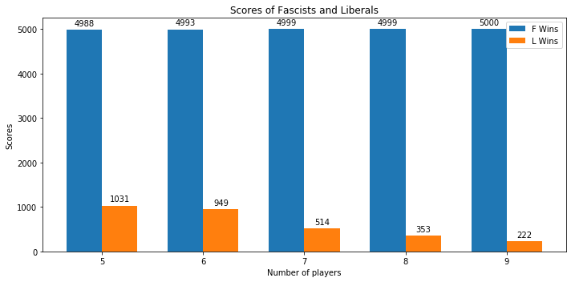
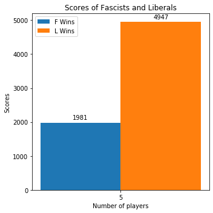
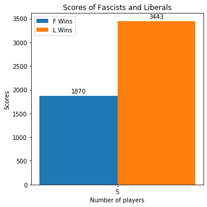

# Secret Hitler
Authors:
- Wester Coenraads (s2983928)
- Battu Surender Harsha (s4120310)
- Dirk Jelle Schaap (s2745135)

## Introduction
**Secret Hitler** is a social deduction card game that came to life via a very successful Kickstarter project. Around 5-10 people have to succeed in finding and stopping the Secret Hitler. Players are secretly divided into two teams: the liberals, who have a majority, and the fascists, who are hidden to everyone but each other. If the liberals can learn to trust each other, they have enough votes to control the elections and save the day. However, the fascists will say whatever it takes to get elected, advance their agenda, and win the game. The essence of the game is this: the fascists are in the minority, and will pretend to be liberals. The liberals don’t know who the fascists are, and it is crucial for them to figure this out in order to win. Every round, a policy (either liberal or fascist) is passed by two of the players. The passed policy is public information, and can be used by players to deduce likely fascists. In this way, the players have no direct information of who are fascists, but have indirect information. For example, if players A and B passed a fascist policy, they are likely to be fascists.

In this project we aim to create a multi-agent simulation of the Secret Hitler game. To model the original game in all of its glory is too much to take on, so we will be implementing a simplified variant that is still representative of the original, but has shed some of its complicating details. In this simulation, the players of the game will be represented by the agents. Their tasks are still to figure out who the fascists are if you're a liberal, and to pass fascist policies if you're a fascist.

### Game Rules
If you wish to get more familiar with the game in its original form, please refer to the rules [here](https://cdn.vapid.site/sites/a67e0c72-4902-4365-a899-3386df73c2c4/assets/Secret_Hitler_Rules-023bc755617986cb2276a3b6920e43e0.pdf).

## Setup
### Program
Secret Hitler is a complex game, so we construct a somewhat simplified rule set that will allow for easier modelling.
- Executive actions are removed from the rules, as they are complex and varied conditional effects.
- Rather than drawing policy cards, the president and chancellor each secretly choose ’fascist’ or ’liberal’. If both choose liberal, a liberal policy is passed. Otherwise, a fascist policy is passed. This removes the uncertainty of the deck and the work associated with it (modelling how many cards are left in the deck, et cetera).
- Votes on the president and chancellor are done secretly, rather than publicly. This removes complex situations where player votes are used in combination with previously passed policies to determine that someone is a fascist/liberal – which would lead to highly complex models. It is now purely a way to influence the chances of passing a fascist/liberal policy, and not another situation with many different higher-order deductions and decisions.
- Hitler is no longer a part of the game and is simplified to another fascist. This is probably the most significant simplification and removes the very character that the game's name is based on. If time allows, we may keep Hitler in – but only the fact that Hitler does not know who the other fascists are. The instant win condition when electing Hitler will be removed regardless.
- The liberals or fascists win when a certain amount of their respective policies are passed. Our changes may unbalance the game, making too easy for one side to win – so we have to change the number of policies required for one side to accommodate for that. This is done manually and by trial and error.

The multi-agent simulation's progression through a game is round-based. Agents are placed around a table and each agent is assigned to either be liberal or fascist. Roughly a third of the participating agents will be assigned to be fascist. The fascists know who the other fascists are, but the liberals don't know anything about the other agents' political stances. At the start of a game one of the agents is chosen randomly as the president for that round. In the following round, a clockwise motion will determine that the agent sitting next to the previous president will now become the president. The president picks a chancelor it feels comfortable passing policies with. The chancelor cannot be the same agent for two consecutive rounds. Both the president and chancelor secretly vote to either pass a fascist or liberal policy. The result of their votes on the policy is shown in the table below. Only the result of this vote is publicly announced (i.e. the nature of the passed policy). This information is crucial for all players, since everyone is trying to figure out what player belongs to which of the two parties. Moreover, the president and chancelor get the additional information regarding the voting process. They know their own vote, and can in some cases deduct what the other's vote must have been. This round-based multi-agent simulation continues until enough policies have been passed for either the liberal or fascist party, granting that respective party the win.

|                              | Chancelor votes Liberal | Chancelor votes Facist |
|------------------------------|-------------------------|------------------------|
| **President votes Liberal**  |         Liberal         |         Facist         |
| **President votes Facist**   |          Facist         |         Facist         |

### Epistemic Model
We assume and model the players to play optimally to reduce complication, the game is straight-forward and we attempt to gradually add increasing layers of complexity like strategies.

#### Model Variables
Each state 'S' has 'n' atoms where 'n' is the number of players in the game. Each atom represents the faction of a player.

The model initially is created with  states. The number of liberals is always greater than number of fascists. When the game begins, the fascists get to know each other and all the fascist relations except reflexive relations are eliminated. Relation set for a player consists of all the possible parties of other players, as the game progresses, these relations are eliminated.

#### Public Announcements
Over the course of the game, the model is updated using public announcements. When a round finishes, the information from it is applied to the model using public announcements. The exact information depends on the policy passed, and is listed in the update rules in the next section

#### Order of knowledge
We experiment with different orders by implementing more complex strategies based on the order we are simulating. If it is a zero order simulation, then:

* Fascist presidents choose a random chancellor.
* Fascists always pass fascist policy.
* Liberals vote randomly, yes or no for the government.
* Liberal president chooses a random player as chancellor.
* Liberals always vote liberal policy.

If it is a first order simulation, then:

* Fascist president chooses a random chancellor.
* Fascist always passes a fascist policy.
* Liberals vote no, if they know that the president or chancellor is a fascist, yes otherwise.
* Liberal president chooses a player who he knows is **not** a fascist.
* Liberals always vote a liberal policy.
* Update rule: If fascist rule is passed, then president is fascist **or** chancellor is fascist.
* Update rule: If liberal rule is passed, then president **and** chancellor are **not** fascists.
* Update rule: If the president is liberal and the chancellor is fascist and after the fascist policy has been passed, the president now knows the chancellor is fascist. The same applies when the chancellor is liberal and the president is fascist.

### The Interface
The GUI is made using Pygame's native library found [here](https://www.pygame.org/news). We take the help of Mlsolver package to create and solve Kripke Models which can be found [here](https://github.com/erohkohl/mlsolver).

The game consists of two modes -  Zero order and First Order. Since models do not need to be updated in zero order simulation, there can be 5-9 players in it, whereas the first order simulation can support only 5-6 players max.

#### Usage
Run the script in the console using:

if python3 is the only python on the system: `python HitlerUI.py`

if python2 and python3 are on the system: `python3 HitlerUI.py`

Make sure to run requirements.txt before running the script to install all necessary packages(Pygame and numpy). The package Mlsolver is already included in the repo as it is not an official pip package. 


In the menu screen, the number of players can be entered by pressing the numbers 5-9 on the keyboard and then clicking on either zero order or first order to start the simulation. (Warning: First order can support only a max of 6 players, anymore and the simulation will stop responding).

For zero order simulation, the simulation runs and ends, since there are no model updates, the simulation cannot be paused or inspected, it shows one single flow of the game.

For first order simulation, after the kripke models have been generated, the simulation can be paused anytime by pressing **SPACEBAR** on the keyboard, you will see a message on the console confirming if the game is paused. While the game is paused, you can inspect each agent's knowledge about the other players by hovering the mouse over their body. Pressing **SPACEBAR** again resumes the game with a confirmation message in console. The game runs in a single flow and ends with either party victory.
(Warning: when starting with 6 players for first order simulation, it may take a few seconds to generate the kripke model, the screen may also not be very responsive if pausing doesnt work, try pressing spacebar again until you receive the console message).

#### Demo
<p align="center">

</p>

A typical game screen looks like the image given above, where the blue circles are liberals while the red circles are fascists. *P* denotes the current president and *C* denotes the current Chancellor. The liberal and fascist scores show how many of each party policies have been passed till that point.
In the voting phase, the votes are anonymous and the players do not know of each other's votes, but the vote of each player is shown in the UI for the user to have a better understanding.

<p align="center">

</p>

When the game is paused, users can hover their mouse over a player circle which will get highlighted by a yellow circle, which will they show the knowledge of that player about the other players in the game. It is checked with the kripke model using Mlsolver.

<p align="center">

</p>

As shown, we hover the mouse over a fascist player, who knows who the fascists are and who the liberals are(liberals are represented by blue birds and fascists by red skulls).

#### A knowledge run through the interface
Here we will show how knowledge changes throughout a game(First Order knowledge) and how each player discovers the other player's true role. Fascists already know their roles which implies they already know who the liberals are. The main updates to the model are done with public announcements and the liberals trying to discover who the fascists are.

* **Step One**
<p align="center">

</p>
In the beginning, a liberalist assumes that all the other players are liberals because there is no sufficient *evidence*(knowledge) against any other player being a fascist.

* **Step Two**
<p align="center">

</p>
A fascist policy has been passed since the president is a liberal and a chancellor is a fascist(see table above). Thus, a public announcement is made that either the president is a fascist *or* the chancellor is a fascist and the kripke models are updated.

* **Step Three**
<p align="center">

</p>
All liberals still assume the other players are liberals except the previous president, since the previous president was a liberal and a fascist policy has been passed, his relations in the kripke model conclude that the previous chancellor was a fascist.

* **Step Four**
<p align="center">

</p>
A fascist policy has been passed again, since the president is a fascist, this sends out a public announcement again that either the current president or chancellor is a fascist. Since the current chancellor knows he is a liberal, he knows that the current president must be a fascist from this update. The two liberals in the top now know that the player on the right side is a fascist. 

* **Step Five**
<p align="center">

</p>
With the next president and chancellor being liberls, a liberal policy has been passed, this sends out a public announcement which updates the kripke model that both the president *and* the chancellor are liberals. Only one fascist has been discovered by two players, and there are already two confirmed liberals, this confirmation reduces the models and removes worlds in which those two players are fascists thus eliminating possibilities. The game proceeds.

* **Step Six**
<p align="center">

</p>
The president is a fascist again and a fascist policy has been passed, the chancellor now knows that the president is a fascist. The game continues until all the liberalists have been president atleast once

* **Step Seven**
<p align="center">

</p>
Since 4 liberal policies have already been passed, all liberal players now know who all the other liberal players are, what happens when a fascist now becomes a president?
<p align="center">

</p>
The liberals do not vote for the government, even when the chancellor is liberal, the government fails to come into power and the power of the president is passed on.
The liberal president also now prioritizes in choosing a liberal chancellor since now the president knows who all the liberals are.
Thus the liberals win this game by elimination and usage of knowledge.


## Kripke model
There are several actions that can alter the Kripke model, so here we will formally show the effect of those actions on the game states. In this example we will use a first-order simulation with three agents A, B and C. Agents will believe another agent is fascist or liberal after just one passed policy, in order to simplify. In the simulation agents will only start to draw conclusions about the other agents' factions after multiple passed policies. Please note that reflexive relations are not drawn to minimiza clutter in the graphs.

When worlds are no longer accesible by any agent, they will be removed. In theory, a simulation with 3 agents would result in 2^3=8 worlds. However, not all of these worlds are possible. It is impossible for the agent set to be fully liberal or fully fascist, so these worlds are excluded. The world that is the exact opposite of the ground truth is also not held possible for any agent and removed.

Let's say agent A is a fascist, while agents B and C are liberals. At the start of the game, all agents know their own factions. Since agent A is a fascist, it knows that it is the only fascist and can already conclude that agents B and C must be liberals. In order to win the game and succeed, you will have to know the factions of the other agents. That way, you can reliably choose who to cooperate with and who you should avoid. Agents B and C now have to figure out this information and try to win the game. Note that agent B is already able to conclude that agent A and agent C cannot both be liberal, because there must be one fascist and agent B is liberal itself. This also holds true for agent C reasoning about agents A and B.

A world accompanied with ```<f, l, l>``` represents the possibilty that agent A is fascist, agent B is liberal and agent C is liberal. Relations regarding agent B are drawn in green, and relations regarding agent C are drawn in blue. Since agent A is given perfect information from the game start, there are no relevant relations for it.


Agent A is selected as president and subsequently randomly selects agent B as chancelor. Agent C allows this government to be formed. Agent A is fascist and will always vote for a fascist policy. Agent B is liberal and will vote the opposite. This will cause a fascist policy to be passed.

- Agent B has learned that Agent A is a fascist.


Agent B is selected as president and subsequently randomly chooses agent C as its chancelor. Agent A votes yes and allows this government to pass a policy. Both agents involved are liberals and will vote so. This causes a liberal policy to be passed.

- Agent B has learned that Agent C is a liberal.
- Agent C has learned that Agent B is a liberal.


After just two passed policies, the two liberal agents were able to figure out what faction the other agents belong to and just one possible world remains. We have to remember, of course, that in the real simulation it would take multiple involvements in passing fascist/liberal policies in order for agents to draw conclusions about other agents.


## Results
Simulations have been run without the UI, which enables us to run games faster.
We have divided the results into different experiments to see how each faction performs in different orders and different settings.

### Experiments
Each experiment consists of a 1000 simulations of games and its results.
#### Zero order
The Zero order experiments have been run from 5 player games to 9 player games and we have plotted out a bar diagram to compare the scores(policies passed in all games combined) of both the factions.

<p align="center">

</p>

The fascists score outweights the liberals score by a large margin, this is most likely due to how easy it is for fascists to score. The only time a liberal policy is passed(scored) is when both the president and chancellor are voted into power and they are both liberals. Thus, liberals scoring is a game of chance. Also we notice the trend where the liberal score decreases as the number of players increase, this is due to the addition of more liberals increasing more randomness and the addition of more fascists increases the fascists chances of winning.
Since zero order simulation is based on randomness, we decided any other settings would not provide any more insights.

#### First order
Due to the speed of generating and solving kripke models(first order requires reducing kripke models based on initial information), 1000 simulations cannot be run for more than 5 players which is why the experiment has been limited to only 5 players.

<p align="center">


</p>

From the first chart, we can infer that liberals have an edge, as shown in the knowledge run in the program interface above, the fascists start scoring the beginning as everyone's role is hidden. But due to elimination and deduction(knowledge updates and public announcements) the liberals soon discover the fascists and make a perfect score, which explains why the fascists have a decent enough score than compared to liberals in zero order. In the original game, the liberals win if 5 liberal policies have been passed and the fascists win if 6 fascist policies have been passed,but in our case the fascists do not try to fool the liberalists since it is first order, therefore we decided to reduce the fascists policy required to 3, whose results are shown in the First order partial score chart. The fascists perfomance has improved, but their winrate still remains the same. We assume that upon increasing the number of players, the fascists are more difficult to get discovered completely which may give them a chance.

## Discussion
In summary: we have implemented a system that simulates Secret Hitler at the 0th and 1st order. Model explosion means that for higher player counts, the simulation takes too long to run the logic. Even so, we can make some inferences about the balance of the game.

If the system were to be expanded, higher-order simulations would be the first step. In these simulations, fascists could try to fool liberals, and liberals could reason about fascists possibly fooling them. These more complex strategies could yield some interesting results. However, they also greatly increase the complexity of the simulation.
They can be benificial to solving the game(balancing out the power of fascists and liberals). We have noticed that zero order and first order mimic some real life players: zero order being players who haven't read the rules of the game and first order being players who have read the rules of the game but are not using any tactics to win.


